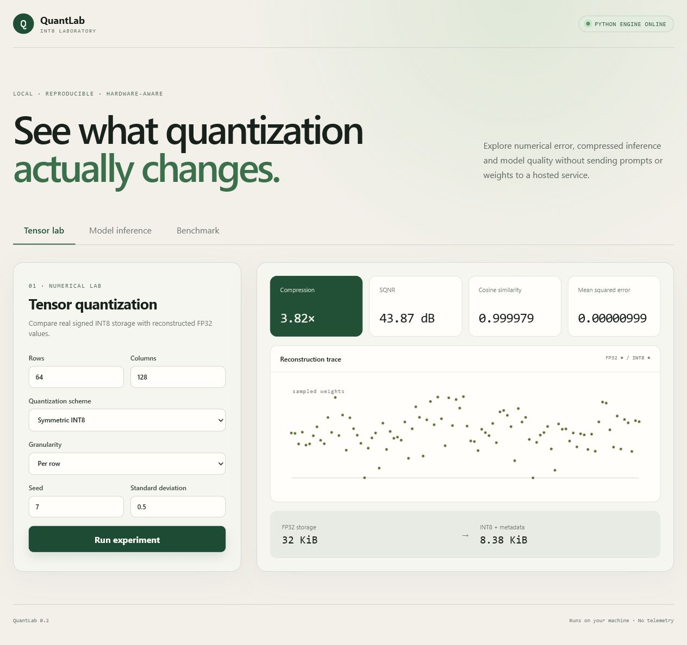
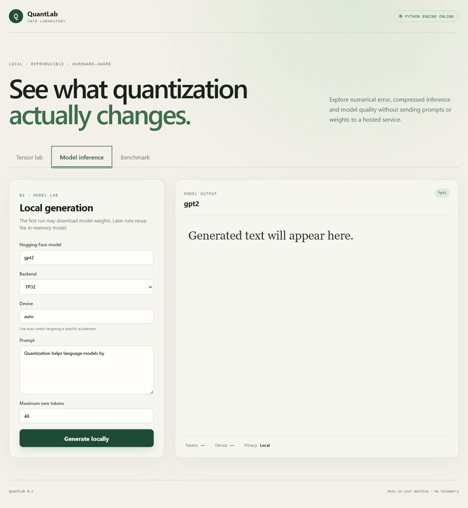
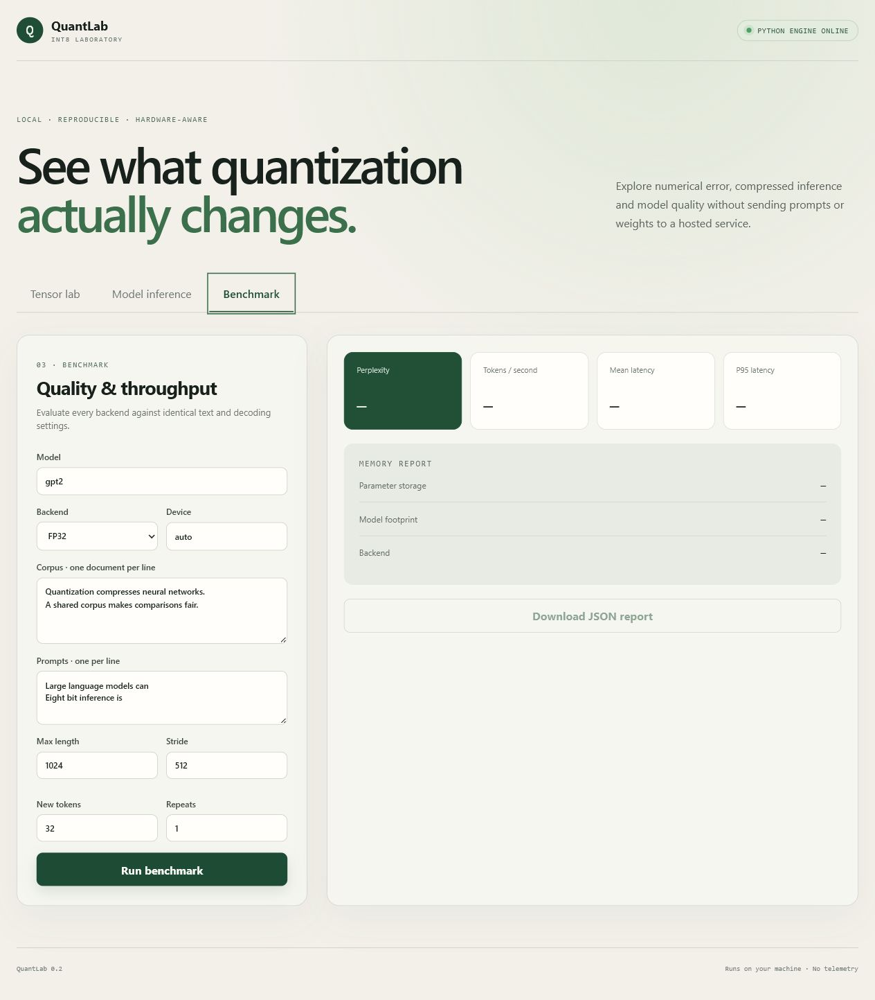

# QuantLab: reproducible LLM quantization benchmarks

QuantLab is a hardware-aware benchmark for studying how post-training quantization changes language-model memory, quality, and inference performance. It combines transparent NumPy implementations of INT8 quantization with deployable backends for Transformers, bitsandbytes, and OpenVINO.

The project deliberately separates two ideas that are often confused:

- **simulated quantization** quantizes and then dequantizes tensors to measure numerical error;
- **compressed inference** keeps weights in a low-bit representation and uses a runtime that can execute it efficiently.

The original GPT-2 notebook remains in the repository as historical learning material. The package and command-line tools provide the reproducible experiment layer.

## Interface preview

<p align="center">
  
</p>

<p align="center"><strong>Tensor Lab</strong> — real INT8 storage, reconstruction trace, compression, SQNR, cosine similarity, and error metrics from the local Python engine.</p>

<table>
  <tr>
    <td width="50%"></td>
    <td width="50%"></td>
  </tr>
  <tr>
    <td align="center"><strong>Local model inference</strong></td>
    <td align="center"><strong>Quality and throughput benchmark</strong></td>
  </tr>
</table>

## Windows: clone, install, and run entirely in PowerShell

Prerequisites: [Git for Windows](https://git-scm.com/download/win), [Node.js LTS](https://nodejs.org/), and Python 3.10 or newer. After installing them, reopen PowerShell so the commands are available.

Copy and paste this complete block. It clones the current default branch into `%USERPROFILE%\QuantLab`, installs the Python and locked Node dependencies, validates both runtimes, starts FastAPI and React, and opens the browser:

```powershell
$repo = "https://github.com/Saroswat/Reducing-the-size-of-Large-Language-Models-with-8-bit-quantization.git"
$destination = Join-Path $HOME "QuantLab"

if (Test-Path (Join-Path $destination ".git")) {
    git -C $destination pull --ff-only
} elseif (Test-Path $destination) {
    throw "Destination already exists and is not a Git checkout: $destination"
} else {
    git clone $repo $destination
}

powershell -NoProfile -ExecutionPolicy Bypass -File "$destination\scripts\setup_and_run.ps1"
```

After the first clone, future runs only need:

```powershell
powershell -NoProfile -ExecutionPolicy Bypass -File "$HOME\QuantLab\scripts\setup_and_run.ps1" -SkipInstall
```

For a reusable installer, download [`scripts/clone_setup_run.ps1`](scripts/clone_setup_run.ps1) to a temporary file and execute it. This avoids piping remote code directly into `Invoke-Expression` and lets you inspect the downloaded script first:

```powershell
$installer = Join-Path $env:TEMP "quantlab-clone-setup-run.ps1"
$installerUrl = "https://raw.githubusercontent.com/Saroswat/Reducing-the-size-of-Large-Language-Models-with-8-bit-quantization/refs/heads/agent/quantlab-modernization/scripts/clone_setup_run.ps1"
Invoke-WebRequest -UseBasicParsing -Uri $installerUrl -OutFile $installer
powershell -NoProfile -ExecutionPolicy Bypass -File $installer -Destination "$HOME\QuantLab" -Backend transformers
```

The reusable installer verifies the Git remote, refuses to overwrite another directory, rejects dirty updates, and supports `-Backend openvino`, `-Backend all`, `-CheckOnly`, `-NoBrowser`, and `-SkipUpdate`.

When running, open `http://127.0.0.1:5173` for the dashboard or `http://127.0.0.1:8000/docs` for the API. Press `Ctrl+C` in the PowerShell window to stop both services.

## What this project answers

- How much memory do FP32, FP16, bitsandbytes INT8, and OpenVINO INT8 use?
- What is the perplexity change when every backend sees the same evaluation tokens?
- How do per-tensor and per-channel quantization affect reconstruction error?
- What are the latency and throughput trade-offs on the target machine?
- Which layers are most sensitive to quantization?

## Experiment matrix

| Backend | Representation | Primary use |
| --- | --- | --- |
| `fp32` | full precision | quality reference |
| `fp16` | half precision | reduced-precision GPU reference |
| `bnb-int8` | outlier-aware `LLM.int8()` | GPU compressed inference |
| `openvino-int8` | OpenVINO/NNCF INT8 | CPU/GPU deployment |

The core module additionally implements symmetric and affine signed INT8 quantization, both per-tensor and per-channel. Those implementations retain `int8` values and explicit scale/zero-point metadata; dequantization is a separate operation.

## Installation

Python 3.10 or newer is recommended.

```bash
python -m venv .venv
# Windows: .venv\Scripts\activate
# Linux/macOS: source .venv/bin/activate

pip install -e ".[dev]"             # core algorithms and tests
pip install -e ".[transformers]"    # FP32 and FP16 benchmarks
pip install -e ".[bitsandbytes]"    # NVIDIA LLM.int8()
pip install -e ".[openvino]"        # OpenVINO export/inference
```

Extras are separate because bitsandbytes and OpenVINO target different hardware environments.

## Quick start: inspect quantization error

```bash
quantlab tensor-demo --shape 256 768 --axis 0 --seed 7
```

Example output fields:

```json
{
  "scheme": "symmetric",
  "granularity": "per-channel(axis=0)",
  "storage_bytes": 198144,
  "compression_ratio_vs_fp32": 3.97,
  "mse": 0.000061,
  "cosine_similarity": 0.99997,
  "sqnr_db": 42.1
}
```

The exact values depend on the generated tensor and are intentionally not hard-coded in this README.

## Local browser laboratory

QuantLab includes a React dashboard backed by a local FastAPI service. It provides three interactive workspaces:

- **Tensor lab** visualizes FP32-to-INT8 reconstruction and compression metrics.
- **Model inference** loads a selected backend and generates text on the local machine.
- **Benchmark** measures shared-corpus perplexity, latency, throughput, and memory, then exports JSON.

### One-command Windows setup

The launcher is [`scripts/setup_and_run.ps1`](scripts/setup_and_run.ps1). It safely creates or repairs `.venv`, installs the selected Python backend, installs the locked Node dependencies, validates both runtimes, starts FastAPI and Vite, and opens the dashboard. Paths containing spaces are supported.

#### Direct copy/paste for this checkout

This command works from **any PowerShell directory** on the current development machine:

```powershell
powershell -NoProfile -ExecutionPolicy Bypass -File "C:\Users\Saroswat - XPS\Documents\Codex\2026-07-12\h\work\quantlab\scripts\setup_and_run.ps1"
```

#### Portable command after cloning

From the repository root, run:

```powershell
powershell -NoProfile -ExecutionPolicy Bypass -File .\scripts\setup_and_run.ps1
```

The default installs the Transformers/PyTorch backend. The first run can take several minutes because Python packages and model dependencies may need to download.

Choose OpenVINO or install every backend with:

```powershell
powershell -NoProfile -ExecutionPolicy Bypass -File .\scripts\setup_and_run.ps1 -Backend openvino
powershell -NoProfile -ExecutionPolicy Bypass -File .\scripts\setup_and_run.ps1 -Backend all
```

Useful options:

```powershell
powershell -NoProfile -ExecutionPolicy Bypass -File .\scripts\setup_and_run.ps1 -CheckOnly
powershell -NoProfile -ExecutionPolicy Bypass -File .\scripts\setup_and_run.ps1 -SkipInstall
powershell -NoProfile -ExecutionPolicy Bypass -File .\scripts\setup_and_run.ps1 -NoBrowser
```

When startup succeeds, use:

- Dashboard: `http://127.0.0.1:5173`
- API documentation: `http://127.0.0.1:8000/docs`
- Stop both services: press `Ctrl+C` in the same PowerShell window

The manual setup remains available below for users who prefer individual commands.

Install the Python service and at least one model backend from the repository root:

```powershell
python -m venv .venv
.venv\Scripts\Activate.ps1
python -m pip install --upgrade -e ".[web,transformers]"
```

Install the browser dependencies and start both processes:

```powershell
cd web
npm ci
npm run dev
```

Open `http://127.0.0.1:5173`. The React development server runs on port 5173 and the FastAPI service runs on port 8000. Press `Ctrl+C` in the terminal to stop both.

For Intel OpenVINO INT8 instead, install the OpenVINO extra before starting:

```powershell
python -m pip install --upgrade -e ".[web,openvino]"
```

The dashboard does not load remote fonts, analytics, or telemetry. Model repositories may be downloaded by their backend the first time a model is selected; subsequent inference uses the locally cached weights.

API documentation is available while the service runs at `http://127.0.0.1:8000/docs`.

## Fair model benchmark

Create a small UTF-8 corpus with one document per line, then run each backend against the same file and settings:

```bash
quantlab benchmark \
  --model gpt2 \
  --backend fp32 \
  --corpus examples/eval_corpus.txt \
  --prompts examples/prompts.txt \
  --output results/gpt2-fp32.json

quantlab benchmark --model gpt2 --backend bnb-int8 \
  --corpus examples/eval_corpus.txt --prompts examples/prompts.txt \
  --output results/gpt2-bnb-int8.json
```

Each report records:

- backend, model, device, package versions, and seed;
- parameter bytes and reported model memory footprint;
- perplexity on the exact same tokenized corpus;
- mean and p95 generation latency;
- generated tokens per second;
- prompt and generation settings.

Compare reports:

```bash
quantlab compare results/gpt2-*.json
```

## Methodology

### Quality

Perplexity is computed with a sliding window over one fixed token sequence. Labels that fall outside the newly evaluated stride are masked, preventing overlap from being counted twice. Comparing perplexity on separately generated text is invalid because the models are not evaluated on the same prediction task.

### Performance

The benchmark warms up the backend, uses deterministic greedy decoding, synchronizes CUDA when applicable, and reports end-to-end generation latency plus output-token throughput. Run measurements on the deployment hardware; cloud notebook numbers are not portable.

### Memory

`model.get_memory_footprint()` is recorded when supported. Parameter storage is calculated independently from tensor element sizes. Disk artifacts should be measured after exporting the model because simulated quantization does not reduce checkpoint size.

## Reproducible result table

Do not copy unverified numbers into documentation. Generate the reports on your hardware and summarize them in this form:

| Backend | Parameter/storage memory | Perplexity | Perplexity delta | Mean latency | Tokens/s |
| --- | ---: | ---: | ---: | ---: | ---: |
| FP32 | generated | generated | baseline | generated | generated |
| FP16 | generated | generated | generated | generated | generated |
| bitsandbytes INT8 | generated | generated | generated | generated | generated |
| OpenVINO INT8 | generated | generated | generated | generated | generated |

## Advanced investigations

QuantLab is structured to support:

- layer-wise sensitivity analysis using reconstruction error or logit divergence;
- group-wise INT4/INT8 experiments;
- activation calibration and static quantization;
- outlier thresholds for `LLM.int8()`;
- AWQ/GPTQ backends;
- KL divergence between baseline and quantized next-token distributions;
- task-level evaluation through `lm-evaluation-harness`.

## Development

```bash
pip install -e ".[dev]"
pytest
ruff check src tests scripts
```

Core CI does not download model weights. Backend integration runs are intentionally hardware-specific and should be executed through the benchmark CLI.

## Repository layout

```text
src/quantlab/              quantization, metrics, evaluation, backends, CLI
web/                       Node, Vite, and React local dashboard
tests/                     deterministic model-free unit tests
examples/                  shared prompts and evaluation corpus
configs/                   reproducible experiment configuration
results/                   generated report guidance
scripts/                   experiment orchestrator
.github/workflows/ci.yml   lint and test checks
```

## Limitations

- GPT-2 is useful for a fast demonstration but is not representative of every modern architecture.
- Backend support depends on operating system and hardware.
- Perplexity captures language-modelling quality, not instruction following or factuality.
- Quantization results should include multiple models, datasets, and seeds before drawing broad conclusions.

## License

MIT. Model weights and datasets remain subject to their respective licences and terms.
